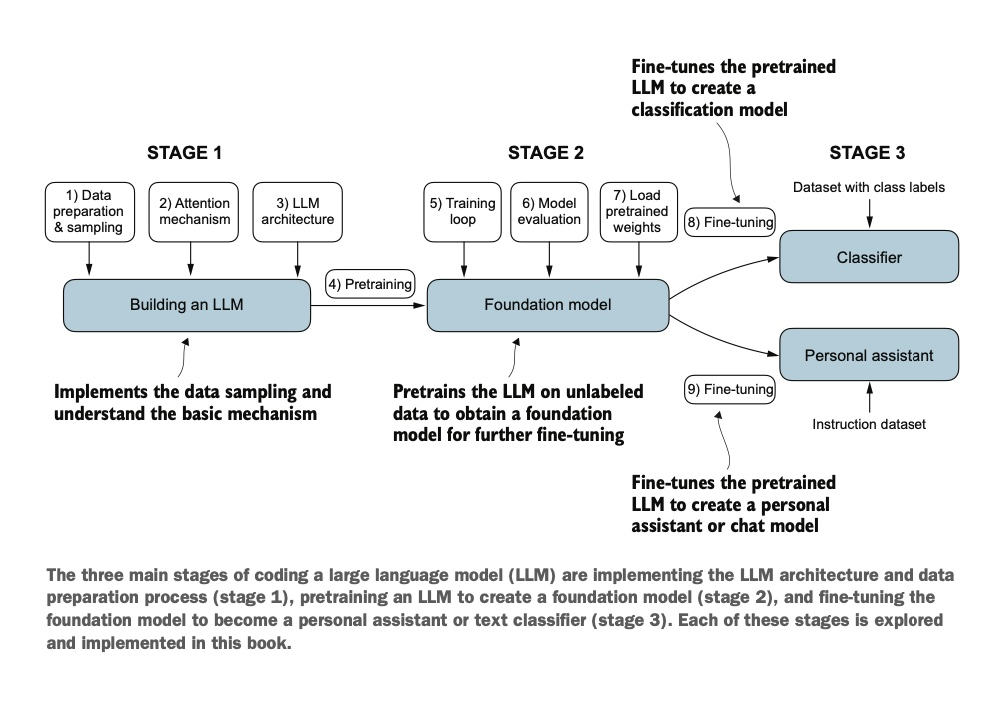

# GPT-From-Scratch

This repo hosts code written while reading [Build a Large Language Model (From Scratch)](https://www.manning.com/books/build-a-large-language-model-from-scratch) book by Sebastian Raschka.

The following diagram taken directly from the book explain the overall workflow at best.

- The `foundation model` is trained on the next word prediction task.
    - The system learns to predict the upcoming word in a sentence by looking at the words that have come before it.
    - This approach helps the model understand how words and phrases typically fit together in language, forming a foundation that can be applied to various other tasks.
    - The next-word prediction task is a form of self-supervised learning, which is a form of self-labeling.
    - This means that we don’t need to collect labels for the training data explicitly but can use the structure of the data itself: we can use the next word in a sentence or document as the label that the model is supposed to predict.
    - Since this next- word prediction task allows us to create labels “on the fly,” it is possible to use massive unlabeled text datasets to train LLMs.
- All task specific models (for example, classifier, chat bot etc. ) are derived by `fine-tuning foundation model` on small, labeled dataset.

# Notes
Ch-02: [data](./data/README.md)